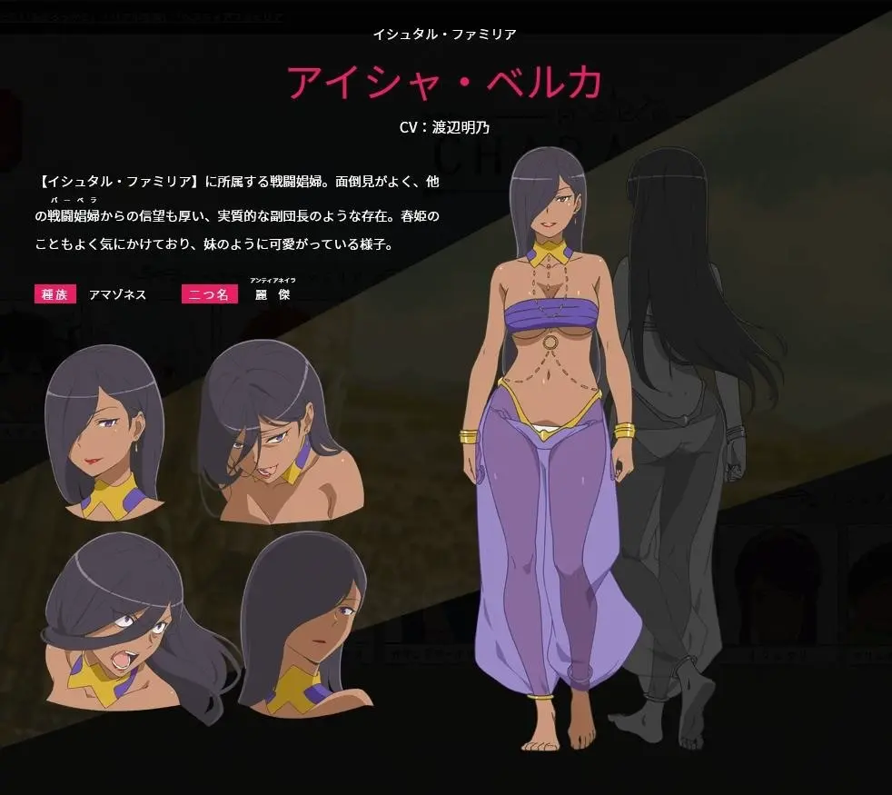

## 賺錢最重要的技能：行銷

* 用一句話總結行銷:

行銷就是找到對的人,在對的時機,用對的方式,傳遞對的價值,促成交換。

* 什麼是好的行銷文?

好的行銷文就是讓讀者感覺「這正是我需要的」,並且迫不及待想採取行動。

* "乾我屁事"原則

## 財富等級

*   **紅外線(Infrared）：學習與生存。** 這是起點，也是掙扎。你可能還在摸索，或者僅僅是為了生存而努力。影響力？幾乎)零。
*   **紅色(Red）：時間換錢，工廠/打卡人生。** 這是最常見的區間，80% 的人困在這裡。你的收入直接與你投入的時間掛鉤，)復一日，年復一年。
*   **橙色(Orange）：專業價值階段。** 恭喜你！你開始創造「付費的價值」。你能解決問題，市場願意為你的專業買單。這是)業的入門，但離真正的「系統化」還有距離。
*   **黃色(Yellow）：系統化階段。** 這是一個關鍵的飛躍！你的收入和影響力開始脫離個人時間，透過系統、流程、團隊，實)可複製、可擴張。
*   **綠色(Green）：擴張型企業家。** 你不再管理單一系統，而是指揮多個「一人團隊」或「AI 驅動的系統」，收入多元化，)響力擴及企業或市場。
*   **藍色(Blue）：投資者。** 讓錢為你工作，你的重心轉向資本運作和資產增值)
*   **靛色(Indigo）：導師/影響力放大者。** 你開始教導、啟發他人，用你的經驗和知識影響社群或行業)
*   **紫色(Violet）：願景創造者。** 你用長遠的願景引導社會系統，影響力擴及產業或大型組織)
*   **白色(White）：精神領袖/全球意識。** 你達到財富、影響力與使命的終極整合，你所做的，是改變整個文明的遊戲規則)

## 歐拉麗冒險者影響力

* Lv1: 下級冒險者(下級冒険者)
  * 在歐拉麗大半冒險者都屬於Lv.1
  * 相當於兼差或者一般工作者
* Lv2: 第三級冒險者
  * 具有中級別的實力
  * 相當於高度專業工作者，薪水比一般工作者高一階 但仍然是社畜
  * 舉例 主角基友
    * 
* Lv3: 第二級冒險者
  * Lv3以上就已經是稀有的上級冒險者，影響力是團隊等級
  * 「阿波羅眷族」團長
  * 
* Lv4: 第二級冒險者
  * 舉例「伊絲塔眷族」阿伊莎能在不同的團隊都發揮影響力，
  * 
* Lv5: 第一級冒險者
  * 舉例「伊絲塔眷族」團長 芙里尼·賈米爾，基本上眷族的人都只能被他指揮
  * 
* Lv6: 
  * 舉例「洛基眷族」團長 芬恩，能指揮多個眷族合作
  * 
* Lv7: 
  * 舉例「芙蕾雅眷族」團長 奧它(オッタル）一人即可與整個眷族對)
  * 
* Lv8: 
  * 宙斯眷族

## 能力堆疊路徑

* 
* 人生的5個桶子
  1. 你知道什麼(知識)
  2. 你能做什麼(技能)
  3. 你認識誰(人脈)
  4. 你擁有什麼(資源)
  5. 外界對你的看法(聲望)
* source: behind the diary - the five buckets

## TA (Target Audience) persona profile

source:
[10 steps to creating a persona—a guide with examples](https://uxpressia.com/blog/how-to-create-persona-guide-examples)

## TA只有一個人?

* 特徵消費者 (Representative Consumer)
* 點估計 (Point Estimate)

* 影響力是逐步擴展的

