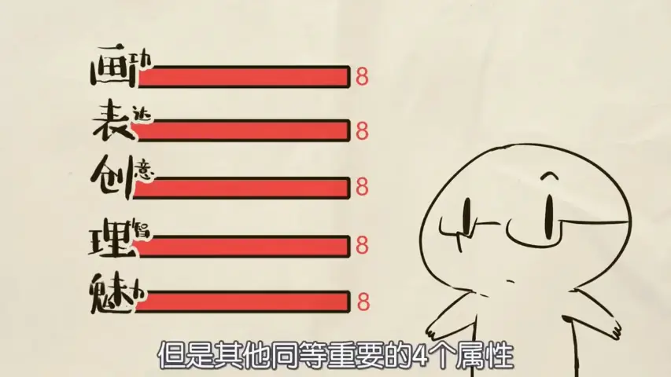
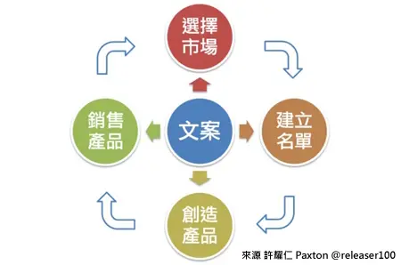
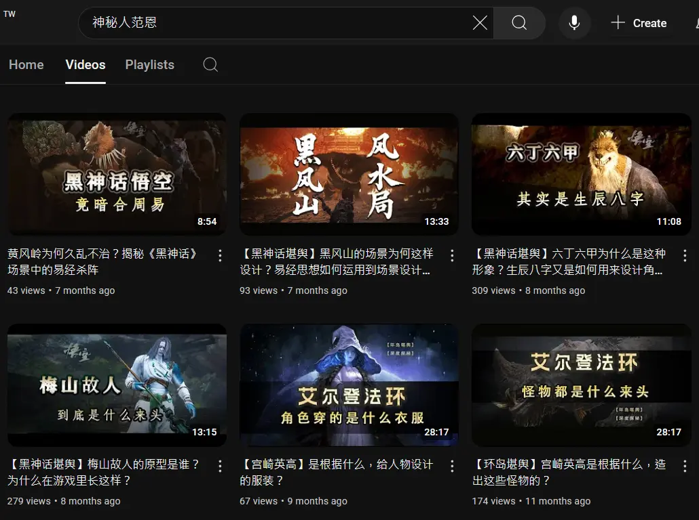

# 個人品牌行銷

## 前置準備
### 核心思想
* 一定要看
  * <iframe width="450" height="255" src="https://www.youtube.com/embed/jnneeT3Mma8" title=" [2020 TGDF] 蛤？遊戲還沒有開始做每個月就有收益是不是搞錯了什麼！？(Kuro) " frameborder="0" ></iframe>  
  * <iframe width="450" height="255" src="https://www.youtube.com/embed/rWWzeNhokFU" title="未来自媒体，要用“资产布局”的思路做？ " frameborder="0" ></iframe>
* 核心思想
  * 要以零成本開始
  * 賺到錢，順便學會XXX
    * 放棄能力主導思維
    * 普通人的財富自由之道
      * 
  * 你摸索出來的能力才是賺錢根基
    *  
    *  
  * 核心能力：Resilience
    * 人生哲學
        * 讓時間成為自己的朋友而非敵人
        * 一輩子的事，可以輕鬆面對
          * 
    * 領先指標 vs 落後指標
      * 菩薩畏因，眾生畏果
      * 
      * 領先指標
        * RSI, 量先價行, ...
        * 學習時間
      * 落後指標
        * 健康檢查
        * MACD, 布林通道, ...
        * 學習成果
        * 單字數量
        * 成就 里程碑
  * 
  * 
    * 絕對的順序
    * 任何一層卡關，都要往下看"所有層"
    * ex: 酷思特
  * 
    * <iframe width="450" height="255" src="https://www.youtube.com/embed/AIufILDRw5U" title="【画成啥样能有收入？0基础咋开始？RPG一样的提升画技全攻略【抖抖村】How to Start Drawing for Beginners" frameborder="0" ></iframe> 
    * <iframe width="450" height="255" src="https://www.youtube.com/embed/Fr_5snieXYw" title="【抖抖村】真!到底什么水平才能靠画画吃饭? How Good Should You Be In Order To Make a Living On Drawing/Making Art" frameborder="0" ></iframe> 
  * 羞愧法則
    * MVP
      * 
    * 
  

### Homework
* 把一定要看的影片看完
  * [2020 TGDF] 蛤？遊戲還沒有開始做每個月就有收益是不是搞錯了什麼！？(Kuro)
  * 未来自媒体，要用“资产布局”的思路做？

## 市場分析

### 行銷
* <iframe width="450" height="255" src="https://www.youtube.com/embed/zWk69IPsMQs" title="如何超过99%的人: 时间管理的奥秘" frameborder="0" ></iframe> 
* Marketing
  * 競品分析
  * 行銷
    * 怎樣是好的行銷文?
      * "乾我屁事"原則
    * 文章架構
      * Hook
      * AIDA架構
        * Attention（注意）
        * Interest（興趣）
        * Desire（慾望）
        * Action（行動）
      * PAS 架構指示：
        *  Problem (問題)： 明確指出目標受眾遇到的問題。
        *  Agitate (激化)： 激化問題的嚴重性，引起共鳴。
        *  Solution (解決方案)： 提供解決方案，並強調客戶的產品/服務的優勢。
      * CTA（行動呼籲）策略
    * 
  * UVP（Unique Value Proposition）獨特價值主張
  * 預購
    * 用收費看市場意願
  * SEO
    * 主要引用資料
      * Jemmy Ko - 讓人一搜尋就找到你
      * 邱韜誠 - SEO白話文
    * Google 的 "E-E-A-T" 原則
    * 「關鍵字 流量」＝「關鍵字 搜尋量」x「關鍵字 點閱率(排名)」
    * SEA + SEO = SEM
      * 主動推播 vs 被動推播
      * 花錢下廣告廣撒 vs 花時間產內容精準集中TA
      * 短期流量流量型 vs 長期成效產品型
    * 搜尋意圖
      * TA導向原則
        * TA設定搜尋情境
        * 解決問題導向
      * 理解使用者
        * 負評
          * steam, google,
            * 不能葉配味道
  * STP（Segmentation、Targeting、Positioning）
  * TA (Target Audience)
    * 普通人的財富自由之道
      * 
    * <iframe width="450" height="255" src="https://www.youtube.com/embed/0pFrpYK5SzY" title="自己画的好没人看，别人画的烂却被吹捧？如何推广自己的作品【抖抖村】How to Promote Your Artwork and Comics" frameborder="0" ></iframe> 
    * 一千個鐵粉理論 (1,000 True Fans by Kevin Kelly )
  * 舉例：YT不同時期算法
    * 2006-2010年：
      * 初期發展，YouTube內容多樣但不專業，用戶尋求新奇和娛樂性。
    * 2011-2014年：
      * 內容創造者崛起，YouTube推出合作夥伴計劃和直播功能，平台推廣長影片。
    * 2015-2019年：
      * 多樣化內容時期，平台推廣中短影片，大頻道多角觸及。
    * 2020年至今：
      * 後疫情時代，專業領域的小頻道成為主流。
      * 分眾化時代
  * 範例：觀察市場
    * <iframe width="450" height="255" src="https://www.youtube.com/embed/jz7oz15Dddw?start=458" title="三国题材游戏美术的深度思考——游戏制作人冬冬专访" frameborder="0" ></iframe> 

### Homework
* 觀察市場 市場在哪?
* 你的TA表
* 最近熱門的主題? 關鍵字?
* 做一個競品分析

## 探勘挖掘
### 帶目的的探索
* 廣泛搜尋
  * 輸出導向
    * 吸引力法則
    * <iframe width="450" height="255" src="https://www.youtube.com/embed/5kNCcpM61eo" title="小心效率陷阱：為什麼你不需要第二大腦或者個人知識庫？" frameborder="0" ></iframe> 
  * 做實驗
    * Jim Rohn --“Formal education will make you a living; self-education will make you a fortune.”
    * 嘗試不同的可能性
  * 尋找更多喜歡的內容? 為什麼? 有什麼特徵?
    * 如果靈感枯竭，如何尋找新的內容題材？
  * 觀察別人的社群如何經營
    * 觀察別人如何規劃漏斗 AARRR
      * 
    * 觀察別人如何經營社群
    * 觀察怎麼製作內容
  * 範例：華德電繪日記 https://www.instagram.com/howardpaint100/
    * 
    * 
* 學習新概念

### Homework
  * 內容形式多樣性： 文章、短影音、長影片、Podcast、社群貼文
    * [舉例A](https://www.facebook.com/AlchemyMage), [舉例B](https://www.youtube.com/@HomunMage/videos), [舉例C](https://podcasts.apple.com/tw/podcast/latticemage/id1693061816)
  * 目標：至少三個平台 每個平台至少5個內容 (記得羞愧法則)
    * 爛產出舉例 https://www.tiktok.com/@latticemage
  * 定義你的"盒子"

## 逆向工程
### Reverse Engineering
  * 
  * 定義與目的
    * 從成功案例中拆解策略
    * 找出核心成功因素
  * 目標
    * <iframe width="450" height="255" src="https://www.youtube.com/embed/oULQfz3vCLg" title="尼可拉斯凱吉回顧經典橋段， 看自己的電影迷因超爆笑！詳細講解他的表演「致敬對象」｜明星的經典角色｜GQ Taiwan" frameborder="0" ></iframe> 
  * 分析流程
    * 案例選擇
      * 競爭對手
      * 同領域成功創作者
      * 不同行業的優秀案例
    * 拆解策略
  * 模式萃取
    * 成功模式
      * 
    * 主題選擇（解決問題型、娛樂型、知識型）
  * 範例：UmaJyeness
    * 
  * 範例：齋藤直葵 讚賞 Ｉｘｙ（いくしー）日更策略
  * 範例：芳斯塔芙 【鬼谷说】
    * <iframe width="450" height="255" src="https://www.youtube.com/embed/zkpmjvc_AM8" title="035｜唐骋/鬼谷藏龙：博士毕业后，我活成了父母长辈不太喜欢的样子｜格致SELF" frameborder="0" ></iframe> 
  * 範例：Gamker 分析各種遊戲
    * <iframe width="450" height="255" src="https://www.youtube.com/embed/LVTgLEi2hjs" title="分析《悟空》的製作和音樂" frameborder="0" ></iframe> 
  * 範例：神秘人范恩
    * 
  * 範例：RnL石葉
    * <iframe width="450" height="255" src="https://www.youtube.com/embed/GnOmGdMh7ww" title="樓梯是如何成為遊戲界難題的？拆解鳴潮和絕區零的解決方案" frameborder="0" ></iframe> 
  * 範例：劇本
    *《先讓英雄救貓咪》
  * 範例：家寧 vs Andy老師
    * <iframe width="450" height="255" src="https://www.youtube.com/embed/sYnFQrP7RLE?start=1172" title="家寧 vs Andy老師" frameborder="0" ></iframe> 
  * 範例：博恩【#段子神偷】
  * 範例：好和弦
    * <iframe width="450" height="255" src="https://www.youtube.com/embed/wHBhX4ldCZ8" title="來 Cover 台北捷運紅線的進站音樂！" frameborder="0" ></iframe>
* 學習新概念

### Homework
* 製作沙盒(sandbox)
* Documentation and Modeling
* 嘗試調整以前的內容 或者發佈新內容 但要應用你分析別人內容的觀念
 
## 商業策略
### 手牌夠多
* 風險管理
  * 平台限制： 如果某個平台演算法改變，導致觸及率下降，我該如何將內容轉移到其他平台？
  * 時間壓力： 如果時間不夠，哪些內容形式可以快速產出？（例如：文字貼文、簡單的短影音、社群問答）
  * 工具限制： 如果無法使用某些專業工具，是否有替代方案？
* 武器庫
  * 實驗的方法
    * A/B Test (Black Box Testing)
    * sandbox
  * 能夠快速切換或結合不同形式
    * 針對不同平台和受眾調整 
  * 跨平台整合策略
    * 一魚多吃原則
      * 同一素材，不同平台演繹
      * 長影片 → 短影音 → 圖文 → Podcast
      * <iframe width="450" height="255" src="https://www.youtube.com/embed/kPXqefd3AAc" title="2025 最有潛力的7種副業？沒有本金也可以達到遠距工作財富自由！【艾學習】｜艾琳的日常" frameborder="0" ></iframe>
  * <iframe width="450" height="255" src="https://www.youtube.com/embed/i5MfoKuo0wg" title="YouTube只是副業？我的20種收入來源大公開｜艾琳的日常" frameborder="0" ></iframe>
    * <iframe width="450" height="255" src="https://www.youtube.com/embed/byzU6Wkiof8" title="[蕾咪] 5種增加收入的方法？下班後幫自己每月多賺3萬元！" frameborder="0" ></iframe>
      * <iframe width="450" height="255" src="https://www.youtube.com/embed/GqikWRLjcoA" title="[蕾咪] 11種被動收入大公開！月入超過6位數怎麼辦到？想提早退休你該這樣做...！" frameborder="0" ></iframe>
  * 內容組合拳戰略
    * 商業模式
    * <iframe width="450" height="255" src="https://www.youtube.com/embed/8BbG1Jr94o8" title=" 一口气了解全球游戏产业 | 为什么最近各大科技巨头纷纷入局?" frameborder="0" ></iframe>
    * 漏斗行銷
      * 3H 
        * Hero： 使用專業、深入的語言，提供獨到的見解。
        * Hub： 使用平易近人的語言，提供實用的資訊。
        * Hygiene： 使用簡單易懂的語言，快速解答問題。
    * 飛輪效應
      * 
        *  飛輪效應——A+企管大師柯林斯，7步驟打造成功飛輪，帶你從優秀邁向卓越 
      * <iframe width="450" height="255" src="https://www.youtube.com/embed/oVtxAm5iOgM?start=720" title="【Krenz】心得：繪畫時的常見問題和心態答疑" frameborder="0" ></iframe> 
      * <iframe width="450" height="255" src="https://www.youtube.com/embed/zF-Yk1h23yw?start=318" title="【無人深空：九年封神】當星空還在讀取、星際公民還在畫餅，它早已用40次免費更新，重新定義了太空神作📰" frameborder="0" ></iframe>
    * 聯盟行銷
    * 尋找導師
      * 普通人的財富自由之道
  * 管理
    * OKR
      * 每一組「目標」（objectives）與2～4 個「關鍵結果」（key results）搭配
    * AAR
      * 《普通人的財富自由之道》書中AAR表
        1. 這個專案的目標是什麼？ 舉辦我的第一次網路研討會，宣傳我新推出的Podcast社群「播客天堂」。
        2. 我完成目標了嗎？ 是的，我成功舉辦網路研討會，有超過一百五十人參加培訓，十四個人購買播客天堂的會員。
        3. 哪部分進展順利？ 我的主題演講進行得非常順利，提供了很多價值，覺得都有順利地傳遞出去。
        4. 哪裡做得不好？ 與會者在即時聊天室提出很多精彩的對話和問題，但我太緊張，只專注在簡報上而忽略了大家的留言。錯過這些互動真的很可惜，因為吸引與會者是建立融洽關係、消除購買障礙的好方法。
        5. 我從這個專案中學到了什麼？ 我了解到網路研討會將是提供有關Podcast的龐大價值的好方法，也是向大家宣傳加入播客天堂會員的絕佳時機。
        6. 該專案是否符合我的業務核心價值觀？ 絕對符合。提供免費、有價值且一致的內容是《火力全開的創業家》的目標。
        7. 我會再做這樣的事情嗎？ 如果大家繼續出席，我每個月至少會舉辦兩次這樣的培訓。
        8. 下次我會有什麼不同的做法？ 我會希望凱特（稍後會詳細介紹她）能幫忙主持聊天室，並及時告訴我大家提出哪些重要的相關問題，好讓我能回覆。
        9. 我可以採用哪些系統和流程來改進執行？ 我會改進我們的電子報排序，以便與會者在網路研討會開始之前，就獲得需要的所有資訊。有很多問題本來可以在網路研討會之前就回答，這樣能讓與會者專注於研討會內容。
        10. 這是我需要花個人時間做的專案嗎？ 還是我可以委託團隊中的某個人或外包出去？
        11. 這為我的業務增添什麼具體價值？ 這場網路研討讓我可以新的方式向聽眾提供免費價值，增加他們對我們的信任。此外，還讓我成為Podcast領域的專家，同時提升我們創立的優質社群「播客天堂」的曝光率。
        12. 還有誰在做這樣的專案，我可以研究和參考？ 劉易斯・豪斯（Lewis Howes）和羅素・布蘭森（Russell Brunson）都是網路研討會的大師。我會報名他們的培訓課程，看看我們的研討會還可以進行哪些改善。
      * 
    * PDCA

### Homework
* 規劃一組商業模式(飛輪 漏斗)
* 現在手上的牌 分析能用的狀況 不能用的時候換哪招? 要去逆向工程甚麼資源來補足?
* 再看一次 
  * [2020 TGDF] 蛤？遊戲還沒有開始做每個月就有收益是不是搞錯了什麼！？(Kuro)
  * 未来自媒体，要用“资产布局”的思路做？