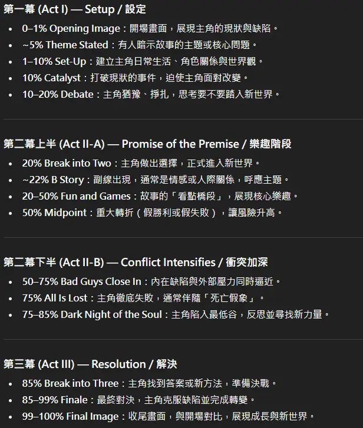
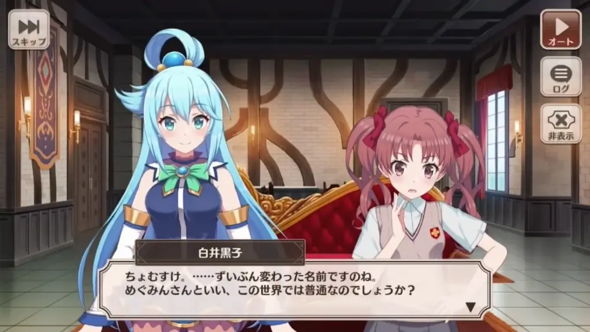
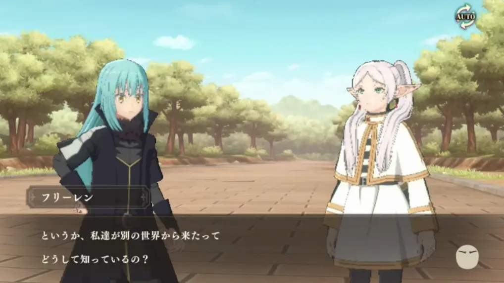
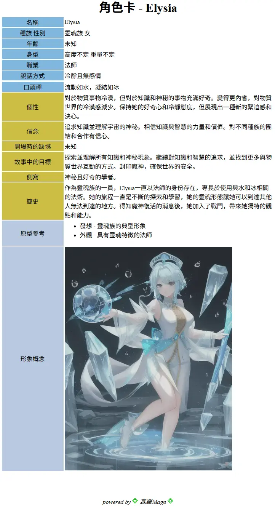

# 劇本設計

## 課前需求 
### 自己找一個工具
  * 嘗試幾個遊戲引擎 找到一個你順手的
  * Ren'Py, TyranoBuilder, RPG Maker, Unity, Twine, Ink, Godot

### 心態建立
* 羞愧法則
  * MVP
    * 
* 常見陷阱 ❌
  * 過度規劃不動筆 → 設定完美主義，永遠在準備
  * 頻繁換點子 → 缺乏執行力，三分鐘熱度
  * 比較心態 → 每個人節奏不同，專注自己進步
  * 忽視修改 → 初稿不是成品，修改才是寫作
  * 閉門造車 → 不尋求反饋，自我感覺良好

## 劇本設計

### 架構
* 園丁
* 建築師

### Scriptwriting
* 發想
  * 靈感來源
    * 觀察生活細節
    * 結合個人興趣
    * 「What If...」提問法
  * 高概念（High Concept）
    * 一句話說清故事
    * 電梯簡報練習
  * 核心主題
    * 想探討什麼議題？
    * 主題層次深化
  * 類型混搭
    * 創造獨特性
    * 避免陳腔濫調
  * 前提測試
    * 故事支撐力檢驗
    * 可行性評估

* 世界觀(背景)
    * 畫面要視線收束設計
    * 世界類型
      * 奇幻：魔法體系
      * 科幻：科技邏輯
      * 現實：細節真實
      * 混合：規則融合
    * 地理與環境
      * 地圖繪製技巧
      * 氣候影響文化
      * 地形與資源
    * 歷史時間軸
      * 重大事件紀錄
    * 社會與文化設定
      * 政治體系（君主/共和/獨裁）
      * 權力結構、派系與陣營
      * 經濟系統（貨幣、階級、資源分配）
      * 語言特色、宗教信仰、價值觀與禁忌
      * 日常生活：衣食住行、節慶儀式、社交禮儀

* 先讓英雄救貓咪 
  * Save the Cat Beat Sheet
  * 

### Homework

* 分析一部作品 可以是 電影/小說/動畫/漫畫
    * 嘗試使用三幕劇架構解構
        * 細化成 Beat Sheet
* 寫一份發想 -> 劇本
  * 

## 人物設計

### Charctor
* 主角 vs 路人
* 角色設計核心
  * 角色原型理論
    * 榮格原型
    * 12種經典原型
  * 三層結構
    * 外層：外貌、職業、技能
    * 中層：性格、說話方式、習慣
    * 內核：信念、恐懼、慾望、創傷
  * 動機系統
    * 需求層次應用
    * 行為邏輯推導
  * 缺陷與成長
    * 完美角色是無趣的
    * 致命缺陷設計
  * **工具**：角色卡、九型人格、MBTI
  * **實作**：創建3個主要角色檔案
  * **作業**：角色「性格測試報告」

* 角色關係網絡
  * 家庭、友情、愛情、敵對
  * 動態關係與轉折
  * 對比與呼應（主角 vs 配角）
  * 群像劇平衡（戲份分配）
  * 對話個性化（語言習慣、口頭禪）
  * **實作**：繪製角色關係網絡圖
  * **作業**：寫4人對話不標註說話者也能區分

* 把他們放在幾個背景下彼此互動
  * 
  * 
  * 
  * 

### Homework
* 設計數個主角 路人
  * 
* 把他們放在幾個背景下彼此互動

## 放入遊戲中

* 場景設計
  * 場景目的：推進劇情、展現角色
  * 結構：目標 → 衝突 → 災難/轉折
  * 場景轉換：流暢過渡、時空跳躍
  * 環境描寫：烘托情緒、氛圍營造
  * 感官細節：五感寫作法、具體化描述
  * **實作**：改寫平淡場景增加張力
  * **作業**：寫5個關鍵場景（各500-1000字）

* 對話藝術
  * 功能：揭示性格、推進劇情、製造張力
  * 潛台詞技巧：說出口 vs 真心話
  * 衝突對話：每場都有微型衝突
  * 方言與口音：特色與可讀性平衡
  * 對話節奏：長短句搭配、停頓與呼吸
  * **實作**：同一對話寫「直接」與「潛台詞」版
  * **作業**：寫揭示重要秘密的對話場景

### Homework
* 設計量體
  * 規劃時程
    * 總工時
    * 不同單位時程 ex: 繪畫, 劇本設計, 放入引擎中
  * check point
* 製作成品
* 結構性修改
  * 冷卻期：放置3天不看再審視
  * 大修重點：劇情邏輯、角色一致性、節奏調整、刪除無用場景
  * Beta讀者回饋：至少3人閱讀並收集意見
  * 自我評估清單：50項檢查要點