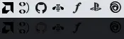
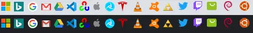

**Favicon Design Principles**

A favicon is the visual representation of a website or application. It should clearly showcase your brand identity while being concise and recognizable. A well-designed favicon is not only eye-catching but also effectively conveys your message.

The key is visibility, especially at the small size of 16x16 pixels. Here are some key elements for designing a good favicon:

### 1. Simplicity and Clarity

Avoid adding too many details or complex patterns to your favicon. Simple icons are generally easier to recognize and remember.
**Example of what not to do:**  

### 2. Clear Colors

Ensure your favicon is clearly visible against different backgrounds. It should stand out on both dark and light backgrounds.
**Example of what not to do:** 

### 3. Avoid Text

Try not to use text in your favicon, as it can be difficult to read at small sizes. Text often makes the icon look cluttered and can easily overlap with other brands.
**Example of what not to do:** 

### 4. Simple Colors

Use a limited number of relatively simple colors. This helps ensure that the favicon remains clear at different sizes.
**Example of what not to do:** 

### 5. Flat and Clean Design

Adopt a flat design style to make the icon look more modern and simple. Avoid excessive shadows or 3D effects.
**Good Examples**: