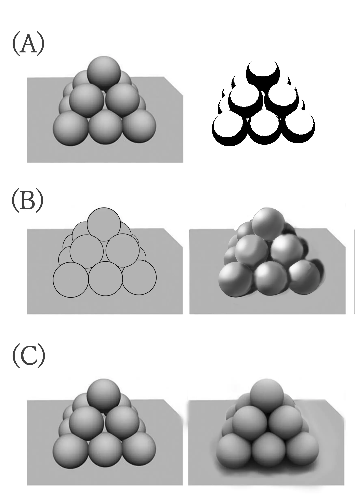

# 選擇題 - 色彩，中階

## Question

哪個進程是XXX?

* (A) 二分
* (B) 打光
* (C) AO(Ambient Occlusion)

## Question

圖中的邊是

* (A) A處是1~2級邊 & B處是 1~2級邊
* (B) A處是3~4級邊 & B處是 1~2級邊
* (C) A處是3~4級邊 & B處是 3~4級邊
* (D) A處是1~2級邊 & B處是 3~4級邊

## Question

圖中的顏色是

* (A) A處是高飽和高亮度 & B處是低飽和中高亮度
* (B) A處是低飽和高亮度 & B處是高飽和低亮度
* (C) A處是低飽和高亮度 & B處是高飽和中高亮度
* (D) A處是高飽和高亮度 & B處是高飽和低亮度

## Question

圖中的顏色是

* (A) A處是高飽和高亮度 & B處是低飽和高亮度
* (B) A處是低飽和高亮度 & B處是高飽和低亮度
* (C) A處是低飽和高亮度 & B處是高飽和高亮度
* (D) A處是高飽和高亮度 & B處是高飽和低亮度

## Question

某個項目是哪種光

* (A) 鏡面反射 (Specular reflection)
* (B) 漫反射 (Diffuse reflection)
* (C) SSS 次表面散射(Subsurface scattering)
* (D) 直射光(Direct Light)

## Question

X是?

* (A) 線搞
* (B) 固有色
* (C) AO
* (D) 二分
* (E) 環境光
* (F) = SSS+(C)+(D)+(E)
* (G) = (F) + (B)
* (H) = (G) + 高光 + 細化
