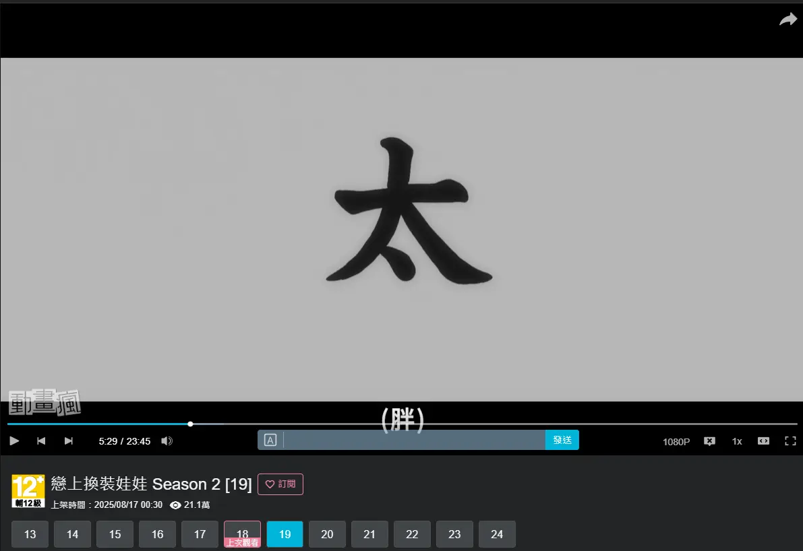

## 沉默期 (The Silent Period)

* **嬰兒不會一出生就說話**
* 在能夠「輸出」之前，大腦需要累積足夠的聽力數據庫
* 不要強迫自己過早開口 (避免挫折感 & 避免固化錯誤發音)
* 聽不懂 = 說不出
* **這不是偷懶，這是必要的程序性知識累積**

## 耳朵與嘴巴的物理連接

* **Shadowing (跟讀法)**
  * 不是為了背誦，是為了訓練口腔肌肉
  * 模仿語調、停頓、情緒 (Copy the emotion, not just words)
* **Echo Method (回音法)**
  * 聽 -> 在腦中回想聲音 (Echo) -> 模仿說出

## Procedural knowledge

* Declarative knowledge vs Procedural knowledge
  * [如何停止翻譯？用英文思考的真相 🧠 語言學觀點分析 // Chen Lily](https://www.youtube.com/watch?v=WxYnyqgO77M)
  * [為何講英文常常要組織很久😥 ？// Chen Lily](https://www.youtube.com/watch?v=XyvhHth6FYQ)

圖片來源: https://courses.lumenlearning.com/suny-oneonta-education106/chapter/5-4-educational-psychology/

## Don't Translate

* 不要做翻譯
  * (O) 🍎(Apple) 
  * (X) 🍎 -> 蘋果 -> Apple

* verständlicher Sprachinput
  * 
  * <iframe width="450" height="255" src="https://www.youtube.com/embed/rw-DW_YlfoI" title=" If You Are A Beginner Watch This NOW! Easy Spanish! " frameborder="0" ></iframe>

## 知行合一

* 外顯知識 (Explicit Knowledge) vs 內隱知識 (Implicit Knowledge)
  * [延伸閱讀](https://alchemy.posetmage.com/Content/Article/Social%20Science/Psychology/Cognitive/Tacit%20Knowledge.html)
* 亞里斯多德
* 王陽明

## 系統2 vs 系統1

<iframe width="450" height="255" src="https://www.youtube.com/embed/8RHGYApR4yY" title="【漫士】为什么要求在比赛中留意提子是反人类的" frameborder="0" ></iframe>

## 髓鞘化(Myelination)

* 硬體加速

https://zh.wikipedia.org/zh-tw/%E9%AB%93%E7%A3%B7%E8%84%82

## 語言石化(Fossilization)

https://en.wikipedia.org/wiki/Fossilization_(linguistics)

## 過擬合(Overfitting) vs 泛化(Generalization)

(圖片來源：https://www.mathworks.com/discovery/overfitting.html)

<iframe width="450" height="255" src="https://www.youtube.com/embed/AJ1TR28KNqY" title="“影分身之术”！训练50亿次的AI能有多智能" frameborder="0" ></iframe>

## Examples

* 不同腔調 (ex: 台灣大部分是美式)
* 吉他尺寸 指版不同
* 不同樂器音色
* 

## My Example

## My Examples

## Homework

尋找多種可能性來達到泛化

