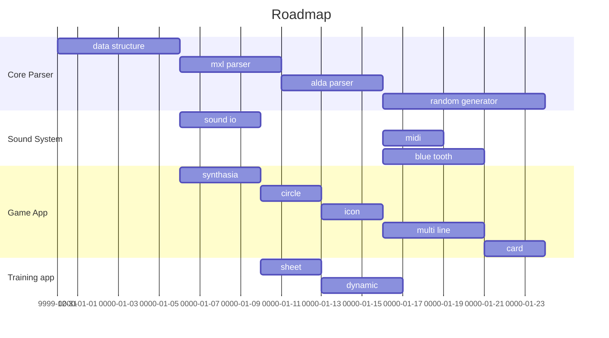

#  PosetMage Game 

## Foundation : [Versatile Utilities](Utility/)

## App1 : [Music Gamification](Gamification/)

## App2 : [Profissonal Training](Training)

## Roadmap

## Marketing/Promoting

* Basic Promoting
  * Able to use mxl, alda
  * Compatible to current community
  * Various visualization 
    * Staff
    * Tablature
    * Synthasia
    * Icon
    * Notation

* Advance Promoting
  * cooperate with youtuber channel
  * cooperate with music classroom, instrument store

* Musician are able to upload their songs score

### Marketing Size
* Training App: smaller users, focus on central targets
* Gamification App: larger users, widely design

## Operation
### Fee
* Stamina System
  * Green hand period, unlimited
  * After Lv.30, only 20 minutes per day
  * Need to buy in store if want to play more
  * 新手優惠期 成癮之後再綁 (養套殺)
* 另一種策略
  * 新手就先鎖，高手自然會去練長期
  * 初期鎖地圖，通關之後可以自由逛不同地圖
* Advertisement
  * Recovery some stamina after watching an ad.
* Experience double, trible package
  * For role faster growthing  
* Education Pack
  * Cooperate with music classroom, school teachers
* 可以PK與否? 有聯機要素嗎
  * 排名會送不同獎勵
  * 包月好處是容易獲得排名

### Industry Life Cycle
* Character cards
  * Keep increasing Character cards
* Map, Mission
  * Increasing missions, stories
* System expansion
  * Not only RPG system
  * Silmuation system
    * Flowers, Pets, ...
    * House, Land, Castle, ...
    * Chicken lay egg, ...
    * Fishing
  * Clothing , Makeup system
    * nail painting
* h-game

## 問卷設計>市場取向

## 有雛型之後眾籌之前
開始談分潤、分股、技術分紅  
參考崩壞三的team怎麼起來  
崩壞一 > 二....> 米哈遊  
