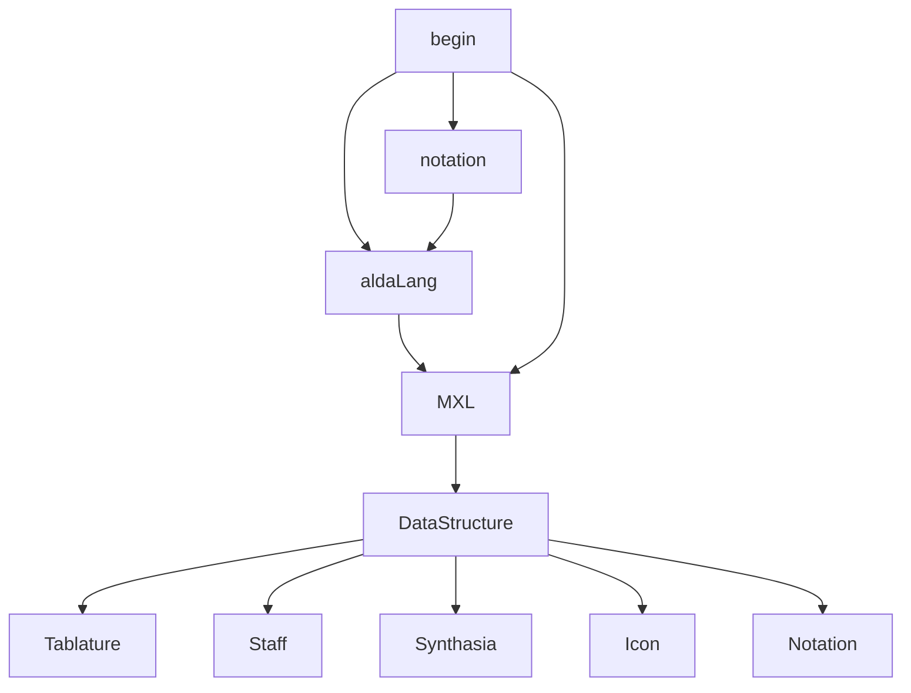

#  PosetMage Music Utility 

## Purpose

Basic features for all application

## Platform

* Platform
  * Mobile in major (1.3 billion at 2021)
  * PC in minor (340 million at 2021)
  * Tablet not target (67 million at 2021)

* Sale on 
  * steam
  * gog
  * google play store
  * apple store
  * etc.

## Data Structure

souce code:  
https://github.com/musescore/MuseScore/blob/master/src/importexport/musicxml/internal/musicxml/importmxmlpass1.cpp

## Music Copyright Issue
* Famous songs?
* Free for user
  * Upload to https://musescore.com/ 
  * Use public domain
* Paid part
  * hololive sing easy copyright songs such as vocaloid
  * deal with Musician or buy from them
  * 跟風蹭熱度

## IO：
* Moblie
  * pinch recognizer
  * hand gesture(left half, right half)
  * (optional) pedal
  * (optional) Aeroband PocketDrum Lite 

* PC (all are optional)
  * midi keyboard
  * phone as midi keyboard
  * keyboard
  * mouse
  * optional

* Bluetooth 
if low latency, need Correction 

## Training Code Flow

Random generate alda with 127 measures

convert alda to musicxml format

parse musicxml to data structure

show measures on screen play sounds

script language:
alda-lang 
reference:
https://github.com/alda-lang/alda

## Technique Requirement

### Product Manager
Design product to get better market

### Producer
Manage resources such time, human, budget

### Music Composition
Need to analysis musics  
rule-based generator for quiz

### Unity3D Engineer
This game is not 3A.  
Unity is suitable.  
(optional) Need to IO with midi in the futuer.

### Game designer
Designing for Motivation.  
Maybe consult the table game designer

### UX/UI
* Front-End Interface Design
* Exprience Design  
* Customization
* https://excalidraw.com/  
* https://www.figma.com/  

### Art
* Concept art for game

### 法律
* 可能會撞到

### User Tester
* people who knows music
* people who don't know music

### Translation
* Major Language: English
* Second Language: Chinese

### Data Server
* Backend server

### Web Server

### AI Algorithm
RNN + decision tree  
Use massive score, sheets to train AI
