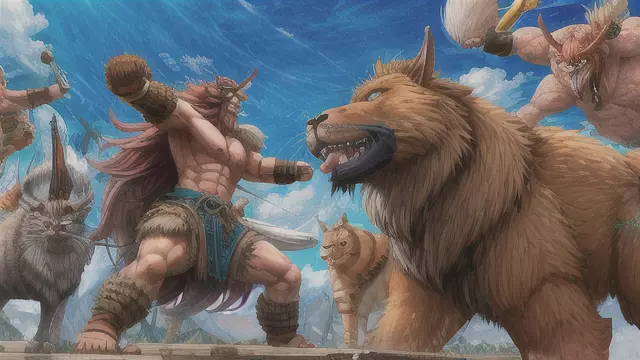

# 戰鬥訓練

不愧是師傅，面對群體的怪物戰鬥仍然游刃有餘

他站在怪物群中心，身形如山，一雙眼睛炯炯有神，毫不畏懼。當敵人紛紛湧至，他迅速反應，巧妙地應對每個敵人的攻擊。

他的動作流暢而精確，腳下的步伐幾乎是舞蹈一般。他利用狡猾的步法，引導敵人站在不利的位置，彼此互相阻礙。

一個怪物出手時，他輕巧地後滾翻避開攻擊，將敵人的拳頭引去擊中跳起的狼犬，利用狼犬失去平衡的時機，毫不猶豫地一刀砍向它。

然後，他向右迅速移動，引導獅鷹繞行錯誤的方向，同時巧妙地將犬熊和哥布林卡住。

他的身體彷彿舞動著，在戰場上穿梭自如。他用強壯的雙臂運用指虎，破壞著敵人的防禦，每一次擊打都帶著驚人的力量。

他與野獸周旋時，嘴角掛著一絲狡黠的笑意。他充分利用獸性的預測能力，快速讀懂敵人的動向，並迅速做出反應。

他的眼神中透露著一種野性和堅毅。每次與怪物的接觸，他都充滿了戰鬥的激情和毅力。他不屈不撓，不斷擊倒敵人，無論他們的數量多麼眾多。敵人在他的攻擊下紛紛倒下，鮮血飛濺。

他的肌肉緊繃，全身散發著熾熱的力量。他的眼神中閃爍著堅定和勇毅，他是一個真正的野獸猎手。他與野獸們纏鬥著，彼此之間交織出一幕幕驚心動魄的戰鬥場景。

當一隻巨大的獅鷹企圖從空中俯衝而下時，他靈活地迴避了它的利爪，同時使出強大的一擊，將它擊飛。瞬間，血液和羽毛在空中飛舞。

在他身邊，犬熊咆哮著，試圖撕裂他的肌肉。他用迅猛的拳頭擊中犬熊的臉部，使其向後退縮，然後毫不猶豫地揮起巨斧，將犬熊的頭部一分為二。

然後，他回頭面對一隻狼犬。狼犬張開血盆大口，瞄準他的喉嚨。他眯起眼睛，看似冒著生命危險，但實際上他已經掌握了時機。

在狼犬咬向他的一瞬間，他猛地彎腰，利用狼犬的力量和咬合力，躍起向上，翻倒在狼犬的背上。趁著狼犬失去平衡的瞬間，他拔出寶劍，瞄準狼犬的頸部，一刀斬下。

戰鬥持續著，他毫不留情地擊倒每個接近他的敵人。他的身體被汗水浸透，但他沒有停下來，沒有絲毫疲憊的跡象。

他與野獸們的戰鬥猶如一場舞蹈，充滿了力量和靈巧。他利用每一個空隙，用技巧和力量擊敗敵人，不管是獸類的怪物還是人型的哥布林，他都展現出超凡的戰鬥技巧和反應速度。

他的每一個動作都帶著獸性的野蠻和精確的打擊。他的拳頭和武器交替使用，破壞著敵人的防禦，讓鮮血四濺。

隨著戰鬥的進行，他的身體漸漸被敵人的傷痕所覆蓋，但他的目光依然堅定。他毫不退縮，不管是面對數量眾多的敵人，還是強大的怪物，他都毫不畏懼。

戰鬥場面中充斥著劍光、拳影和野獸的嘶吼聲。他的每一擊都發出震耳欲聾的轟鳴聲，讓地面都微微顫動。

最後，當敵人的屍體堆疊在他的腳下時，他站在戰場中央，氣喘吁吁，身上的傷口滲著血液。但他的眼中閃爍著堅毅和勝利的光芒。

他是一個真正的野蠻戰士，與野獸為伍，戰勝了敵人的蠻橫和野性。他的戰鬥技巧和力量令人畏懼，他的決心和勇氣令人敬佩。他在戰場上展現出真正的英雄氣概，成為了群體戰中的無敵猛獸。

