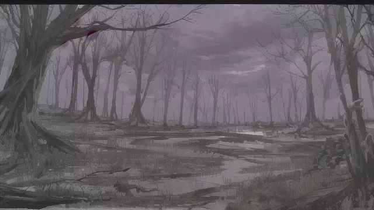

# 死亡沼澤

疾風如怨鬼的呼嘯，驚擾著死靈法師領地的寧靜。這裡是悲傷的樂章，充斥著沼氣與屍毒的悲歌。骸骨散落如同戰場上的遺棄物，不再是有生命的象徵，而是殘酷與死亡的記虐。

這裡，是一個死靈法師的領地，並非常人所能輕易進入。死靈法師的建築應該在荒涼沼澤之中，四周籠罩在厚厚的沼氣之下。那陣陣瘴氣如同令人窒息的惡夢，難以逃脫。

唯一的應對之道，就是借助風精靈的力量，將這些瘴氣隔絕。然而即使如此，偶爾還是會遭遇一些難以抵擋的屍毒。每當這種時刻，就需要用到那寶貴的聖水進行淨化。

沼澤裡，彷彿是亡者的狂舞，幽靈般的存在不定時的出現，讓人心生恐懼。唯一讓人感到奇怪的是，這樣的地方，真的會有人選擇居住嗎？

一路上的恐懼與陰森，只為了找到那個叫做傑卡‧萊伊的人。他，是這片土地上的主人，只有找到他，才能知道結界為何如此不穩定，並且尋求解決之道。

在死靈法師的領地上，每一步都充滿了挑戰與驚駭。然而，為了拯救這個世界，必須要有人去面對這一切。對於即將踏上這片領地的冒險者來說，前方的路，即是危險，也是希望。

