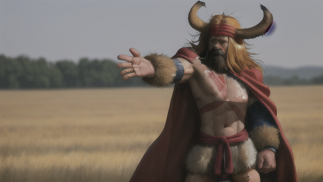

矮人堅定地看著人類少女，並伸出援助的手"你終於醒來了。"

少女似乎昏昏沉沉的，回過神後有些害怕，"你是誰？不要靠近我！"

矮人平靜地回答，"掠奪已經結束，我們大部隊正在把物資運回部落。你就跟我走吧，我收你為徒。"

"我怎麼可能接受野蠻人的收編？" 少女的眼中閃爍著不信任和恐懼。

矮人瞥了一眼四周的慘況，"看看附近吧，你沒有選擇。"

少女急切地張望四周，"我的同伴們呢？他們在哪？"

"我們只是拿回本屬於我們的東西，並無意做無謂的殺戮。" 矮人淡淡地說。

"你們只是搶劫，還有甚麼好說的！" 少女尖叫道，但她的目光落在遠處的同伴們身上，看到他們都只是輕傷，有些寬慰。

矮人沉默了一下，然後說，"你們算是任務失敗，並不會拿到獎賞，而你們也沒有能力回到安全的地方，你跟我走起碼是安全的。"

"我要跟他們一起走！" 少女堅定地說。

矮人皺眉，"如果我們不是搶奪而是真的發動殺戮，就憑你們是無法活下去的。你還不如開始學習自保的戰鬥能力。"

"我要跟他們一起成長！" 少女再次反駁。

矮人嘆了口氣，"你的資質在他們之上，你的同伴們之中有戰鬥的高手可以指導你嗎？我看到了你在混亂中做出正確的判斷並且找到安全的躲藏路線，這是很重要的擺脫困境能力。"

少女毫不猶豫地說，"我要跟他們一起走，你要帶我走就要帶他們一起走。"

矮人冷笑道，"我不可能帶著一堆拖油瓶，他們跟你是甚麼關係？生死之交還是青梅竹馬？"

少女想了一下，然後搖了搖頭，"不過是因為這次任務一起組隊的人……" 她的聲音微微的顫抖，似乎在回想著一些事情。

矮人重重地點了點頭，"使用所有可以使用的資源才是最聰明的方式。"

少女看著矮人，默然點頭。她知道這個野蠻的矮人說的是實情，她需要生存，而不是與人為敵。