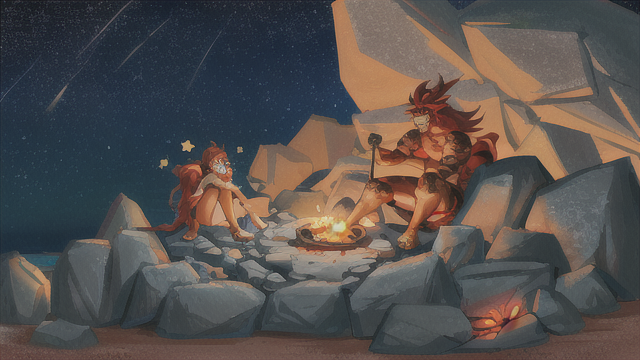

在黑夜的星空下，矮人師父和人類少女疲憊地坐在一塊巨石上，他們的身邊堆滿了獵殺的生物。這些獵物已經被剖開，血淋淋的內臟暴露在空氣中。矮人師父抓起一把鋒利的利刃，手腕熟練地滑過獵物的皮膚，揭示出脂肪豐厚的肌肉。

他小心翼翼地將內臟取出，一根接一根地清洗。清水從他的手中流下，將內臟的血迹和污垢沖刷乾淨，直到它們完全潔淨如新。他仔細檢查每一個角落，確保不留下任何雜質。

與此同時，人類少女負責準備營火。她從附近的灌木叢中採集柴火，挑選了乾燥的木枝和樹葉。她巧妙地插上幾根鐵根，這些鐵根既能提供支撐，又能在加熱時均勻地散發熱量，確保肉類能夠完美地烤熟。

營火燃燒時，微弱的火光映照在他們的臉上。火焰蠢蠢欲動，宛如跳躍的精靈，為這個黑暗的夜晚帶來一絲溫暖。少女小心翼翼地將柴火疊放在火堆中，用火石和火槍點燃了火種，引發了一場明亮的烈火。

師父將剛剛清洗過的肉塊小心地放在鐵根上，確保它們緊緊地固定在火焰的正上方。這樣，肉塊能夠獲得均勻的熱量，從而完美地烤熟。

隨著火勢的舒展，肉塊散發出誘人的香氣。火焰將它們包裹在溫暖的光芒中，將肉的色澤映照得金黃誘人。師父注視著營火，微微皺起眉頭，他細心調節著火勢，確保肉類均勻受熱，使其烤得香嫩多汁。

遠處，破碎的遺址蔓延著，作為這個荒野世界殘酷的見證。然而，在此刻，師父和少女陶醉於烤肉的喜悅中，他們忘卻了世俗的紛擾。他們的眼神充滿了滿足和感激，他們沉浸在這份野外的豐收中。

他們靜靜地等待著肉塊的完美時刻，火焰輕輕燃燒，星空閃耀，彷彿宇宙為這美好時刻增添了神秘的光彩。这个夜晚，他们共同創造了一場美味的狩獵盛宴。

[詠唱過程](./gpt/1-1-d.chat.html)

