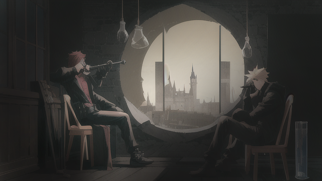

矮人師傅站在窗邊，僅有的月光射進室內，把他的身影拉長。他的視線透過望遠鏡，銳利而堅定。他一直在密切關注著帝國的一舉一動，尤其是他們的兵力部署和物資運送。他的臉龐被望遠鏡的影子遮住一半，那些年歲刻畫的痕跡顯得尤為顯眼。

"你在這邊觀察帝國動向，是為了什麼嗎？"身旁的人類少女傳來疑惑的聲音。她抱著雙臂，靠著窗框，用一種充滿好奇而又不解的眼神看著師傅。

矮人師傅深深吸了一口氣，將望遠鏡緩緩放下，用無比認真的眼神看著少女， "帝國並沒有派兵到戰場，所以那次你們運送的馬車才會被我們劫持。" 他的語氣平靜而堅定，顯然這是經過深思熟慮的結論。

"帝國那邊的動向只想往東部進軍，還不知道是為何原因。"他將這個觀察告訴了人類少女。他的語調冷靜而緊湊，讓人不禁為他的精確判斷感到驚訝。

少女頓了一下，問道: "為什麼你會這麼說呢？"

矮人師傅將望遠鏡遞給少女，指向遠方的城堡， "看那裡，帝國的士兵正在搬運物資。那些物資的量不小，並且是持續不斷的。只有在籌備大規模的行動時，才會有如此大規模的物資運輸。再加上他們的軍隊一直在向東部移動，那麼，他們很可能是要向東部進軍。"

"所以，為什麼你不願意接受長老的召回，去對抗魔神呢？"少女進一步追問，她的眼神裡充滿了期待，期待師傅給出一個她能夠接受的答案。

少女只是固定地盯著矮人師傅，她想不明白為什麼他們不找帝國的協助，反而要對帝國下手，"魔神都要復活了，我們不是應該請帝國軍協助嗎？為什麼還要襲擊他們？"

師傅低頭避開了她的問問，他握緊拳頭，掌心的疤痕因為用力而變得突出。「少女，你還年輕，有些事情並不像表面看起來那麼簡單。」他的語調變得更加低沉和厚重，像是陷入了深深的回憶中。

「帝國那邊的行為有些異常，我們需要更深入地了解情況才能做出決定。如果他們真的像我們預期的那樣往東部進軍，那麼這一定有他們的原因。我們需要進一步了解這一切背後的含義，並且制定出最佳的策略。」師傅繼續解釋，他的眼神固定在窗外，仿佛在尋找某種答案。

少女默默聆聽，她嘗試理解師傅的言語，但對於這種深奧的策略和戰術，她還是感到有些吃力。但她堅信師傅的話，他一定有他的理由。

在深邃的黑夜中，兩人的對話在房間裡迴響，帶著未知的期待和掛念。師傅再次提起手中的望遠鏡，他的目光深邃而疑惑，尋找著未來可能的路徑。而少女，她只能靜靜地站在他的身邊，為他祈禱，為他們的未來祈禱。

[詠唱過程](./gpt/1-3-a.chat.html)