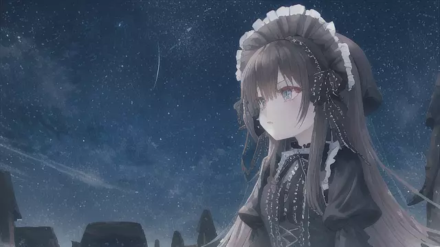

"(我是誰，我在哪裡?)"

"(喔剛剛在驅逐著對神界構成威脅的奇特生物。然而，我不小心跌入了虛空層的結界)"

"(無法掙脫)"

"(掙扎、無助)"

"(好冷)"

"(越來越冷)"

"(身體越來越難動)"

"(記憶像被海浪沖走的沙石，逐漸變得模糊，然後消失....)"

"..."

".."

"."

""

"(我是誰，我來自哪裡，我做過什麼?)"

"(不知道過了多久，可能很長，也可能只是一瞬間。)"

"(雖然感到冰冷，我努力地張開眼睛)"

"(記憶像是被一片白霧籠罩，模糊不清，觸摸不到)"

"(不知道我該做什麼。我只覺得冷，一種源自靈魂深處的寒冷)"

"(掙扎，覺得被困在這個身體和記憶的牢籠裡)"

(睜眼看，抓抓手，似乎是我的手)

"我要去哪?"

"我忘了、就這樣吧"

[詠唱過程](./gpt/2-3-a.chat.html)
