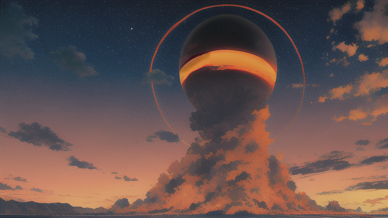

突然發生了一陣強烈的地震，大地劇烈地搖晃著，讓人感到驚慌失措。這場地震似乎是來自遠方的某處，發出了巨大的噴發聲。人們紛紛轉頭朝向聲音的方向望去。

當他們抬頭仰望天空時，驚奇的景象出現了。在這本應該是黃昏時分的天空中，竟然出現了一個巨大的黑色太陽。這顆太陽被紅色的邊界所包圍，它們散發出一種神秘而令人不安的氛圍。

人們心中產生了種種猜測，但同時也感到混亂和恐懼。他們似乎忘記了，或者下意識地拒絕去理解一個事實——那就是以前所謂的魔神封印只是表面上的成功，Entropy的預言是一定會成真的。

人們開始回憶起古老的傳說和預言，關於魔神將會在黑色太陽出現的時候復活的預言。這些預言敘述了一場魔神復活的劇烈事件，將會帶來毀滅和混亂，挑戰著人們的勇氣和智慧。

隨著黑色太陽的浮現，天空逐漸變得陰暗，彷彿夜晚提早降臨。寒意開始籠罩著人們的心頭，他們感受到一股強大而邪惡的力量在逼近。

人們眼中透露出恐懼和不安，但同時也有著不屈的意志。他們明白，面對魔神的復活，他們必須團結一致，尋找解決的方法。這是他們最後的希望，他們必須展現出勇氣和智慧，為了保護自己的家園和所愛的人。

[詠唱過程](./gpt/3-2-b.chat.html)

