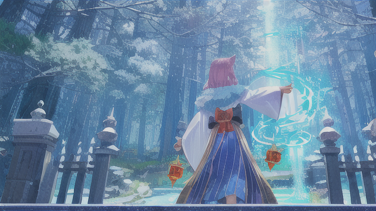

主角進入到神道教的神廟，四處看了看，只見一位妖狐族的少女穿著神道教的服裝在進行著一種神秘的陰陽術。主角便鼓起勇氣向她詢問。

主角： "我想要理解一個人是失憶還是被操控? 你可以幫我解答一下嗎？"

妖狐族少女低頭看了主角一眼，臉上的表情顯得有些不悅。

妖狐族少女： "是八重櫻跟你說我在這邊的吧。真是的，一直以來我們都強調外人是不能隨意進來的，她現在居然讓你進來，這已經違反了我們的戒律了。”

主角聽完妖狐族少女的話，忍不住為自己的行為辯解。

主角： "我們真的需要你的協助。我們聽說你是式神方面的專家，我們想了解控制式神的原理和如何解除。"

妖狐族少女聽了主角的話，微微皺眉，語氣中帶著一絲不耐煩。

妖狐族少女： "你是為了魔神魔將的事情而來的對吧？我這邊並沒有義務幫助你們解決西方大陸的問題。"

主角聽了妖狐族少女的話，瞬間感到有些失落，但他並未放棄。

主角："魔神復活對大家都沒好處，我們應該要同心協力才對。"

妖狐族少女聽完主角的話，沒有絲毫的動容，她瞥了主角一眼，冷冷地說。

妖狐族少女："那只是你們西方的問題。東方這邊並不受其影響，四百年前就已經東西大陸各自為陣。兩百年前東方這邊發生魔力災害的時候，西方也是不干預的，我們無需為你們的問題分憂。"

主角聽完妖狐族少女的話，無言以對，只能無力地低下了頭。

[詠唱過程](./gpt/4-1-b.chat.html)