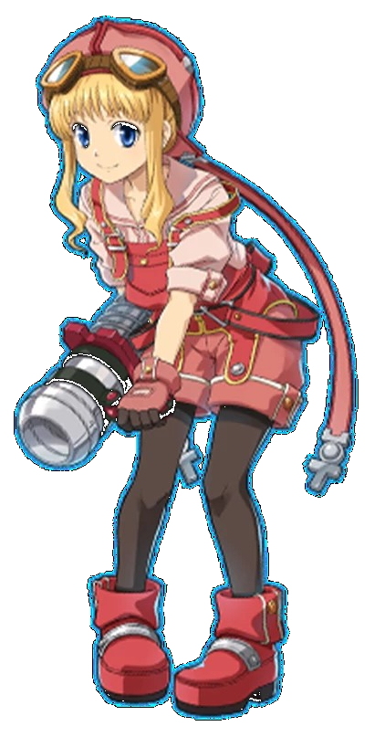

# 角色卡

## Name
Cole

## Race Gender
女姓 矮人族

## Age
98

## Size
身高140 體重50kg

## Profession
鍛造師

## Speaking Style
個性偏向消極負面

## Catchphrase
悲哀阿

## Personality
喜歡與人群相處

## Faith
人生就是悲劇

## Regret
想要成為藝術家，卻必須跟現實妥協先工作

## Goal 
這場戰鬥結束，我就要退休去當個工藝製作師(flag?)

## Another Perspective
被鍛造耽誤的藝術家

## Brief History
比起修理武器，更想要製作藝術品， 
因為家中很窮，必須盡量賺錢，為了保有工作而有一技之長，有著藝術家的精神，為了鍛造符合心中藝術的價值，自己對各種武器都有熟練度，同時也累積了不少戰鬥的經驗。

## References
發想：花冠之淚 - 露絲緹 
外觀：空之軌跡 - 缇妲·拉赛尔

## Concept
一身工作服，感覺就是做粗活的 
單馬尾，容易執行鍛造 
有著安全帽和防風眼鏡，帶著工作手套 
武器是護膝護肘和指虎，擅長進戰肉搏 
腰間配帶鐵鎚、螺絲起子、鑽石銼刀，便於修理裝備和整修地形 

 圖片來源：空之軌跡 

